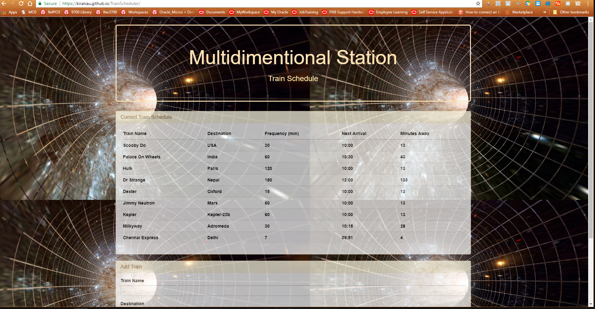

# Train Scheduler

A train schedule application that incorporates Firebase to host arrival and departure data. Used Moment.js to retrieve and manipulate this information. This website provides up-to-date information about various trains, namely their arrival times and how many minutes remain until they arrive at their station.[Please click here to visit the site.](https://kiranau.github.io/TrainScheduler/)

***

